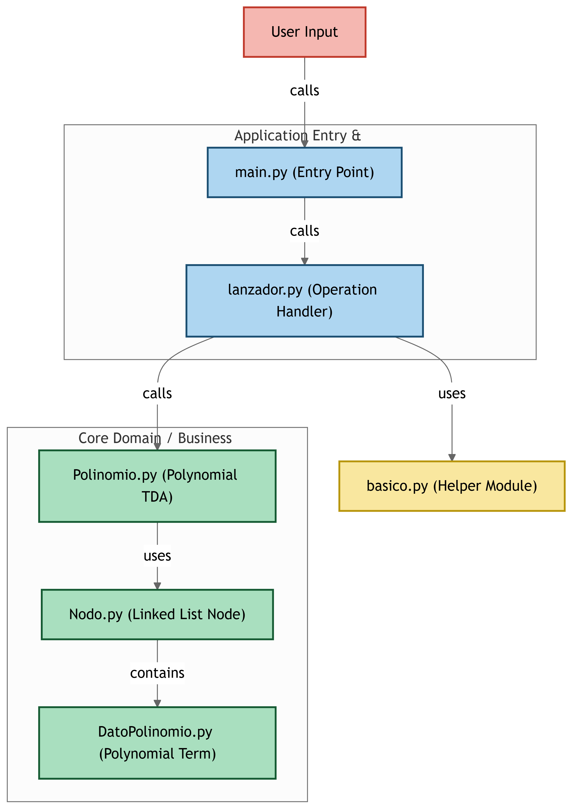

# Polinomio TDA

Este proyecto implementa un TDA (Tipo de Dato Abstracto) para trabajar con polinomios. Permite realizar operaciones como suma, resta y multiplicación de polinomios, además de gestionar términos individuales mediante una estructura de lista enlazada.

## Estructura del Proyecto

- **`main.py`**: Punto de entrada del programa. Permite al usuario realizar operaciones con polinomios desde la consola.
- **`lanzador.py`**: Contiene funciones para realizar operaciones básicas con polinomios, como suma, resta y multiplicación.
- **`Polinomio.py`**: Implementa la clase `Polinomio`, que representa un polinomio utilizando una lista enlazada.
- **`DatoPolinomio.py`**: Define la clase `DatoPolinomio`, que almacena el coeficiente y el grado de un término del polinomio.
- **`Nodo.py`**: Implementa la clase `Nodo`, que representa un nodo en una lista enlazada.
- **`basico.py`**: Archivo reservado para definiciones básicas o tipos adicionales.

## Diagrama del Proyecto

A continuación, se muestra un diagrama que ilustra la estructura del proyecto:



## Funcionalidades

1. **Suma de Polinomios**: Combina los términos de dos polinomios.
2. **Resta de Polinomios**: Resta los términos de un polinomio de otro.
3. **Multiplicación de Polinomios**: Multiplica los términos de dos polinomios.
4. **Gestión de Términos**: Permite agregar, modificar y obtener términos específicos de un polinomio.

## Ejecución

Para ejecutar el programa, utiliza el siguiente comando en la terminal:

```bash
python main.py
```